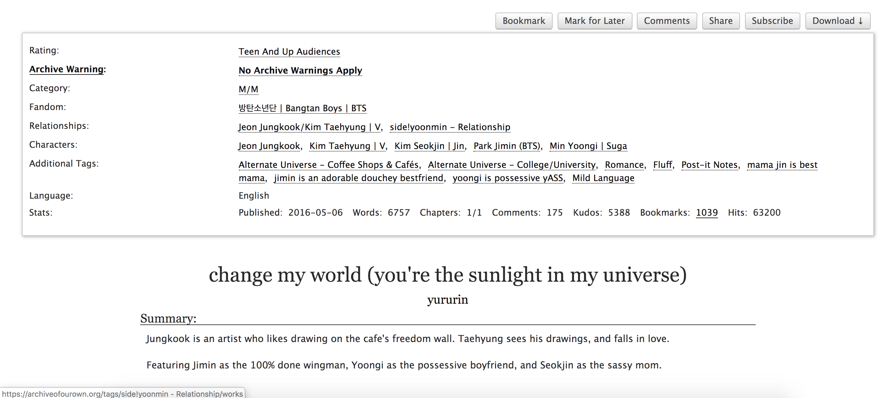
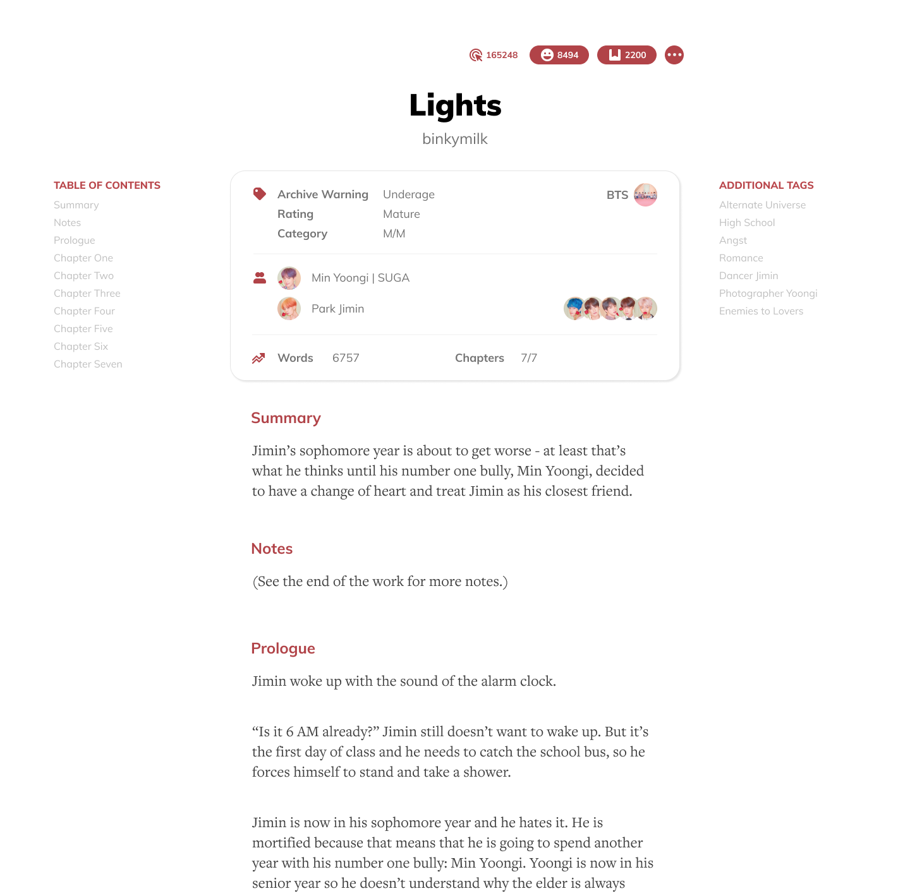
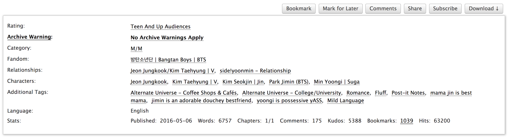
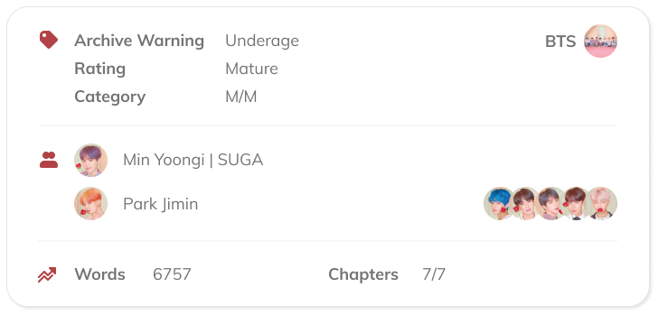

Archive of Our Own (most commonly known as AO3) is a hosting place for fanworks and fanfictions. It's a great avenue for fans to create and host their own works for other fans to enjoy. 

I'm an avid reader of fanfictions but I always have a hard time reading it using my PC. As a nonprofit organization and is only relying from donations and volunteers, I understand that the user interface of the website can be a little outdated. As a challenge for myself, I decided to redesign a page from the website, specifically a page from a fanwork.

Here's an example of the current layout. (Shoutout to the author!)

Here's what it looks like after the redesign.

Note that the redesign only includes the main content; I excluded the headers and footers for simplicity.

What do you think about the redesign?

But before that, let me break all the elements down and why I designed it that way.

## Title

Initially the title was positioned after the block of tags and honestly, it felt weird for me. When the tags are packed, you won't be able to see the title when you first visit the page. It's hidden, which means that I sometimes have to scroll down just to remember the title of the fic I'm reading.

For the redesign, I decided to push the title and author at the top since instinctively, they should be the first thing you should see once you open a fic.

## Typography

I liked AO3's serif font because it mimics the feel of reading an actual book. But having a serif font all throughout the website &mdash; including the buttons, headers, and etc. felt a little bit overwhelming and outdated. I wanted to mix type faces to have a classy but modern looks as well.

For headers and buttons, I used Muli. It adds a playful vibe and easily contrasts the serif font for the body text, where I used FreightText. Just by changing the fonts, it already improved the whole look by a mile.

## Layout

Now here's the root problem why I always had a hard time reading a fic in AO3. The lines are just too wide to read &mdash; which means it tires my eyes out easily. It also makes me lose the line I'm currently reading because my eyes are being swamped with all the words. 

A quick fix and the most obvious solution for the problem I posed above was to shorten the paragraph width. In this way, it takes less effort for my eyes to navigate from the start to the end of the line. I also increased the line height to decrease the chance of me losing the line I'm currently reading. It allows each word to breathe and it achieves a cleaner look.

## Tags

This part wasn't really pleasing since the reader is being bombarded by a lot of text:

It contains a lot of information, some of them are relevant to the reader, some of them, not so much. As a user of AO3, I first asked myself, "What are the most important things that I look at when I open a fic?" Starting from this, I got all the more-important-stuff and placed them directly at the bottom of the title. For the others that weren't so important, I set them aside first while I figure out where to put them.

The archive warning, rating, and category were usually the ones that I look at first before I start reading the fic. For me, they are the most important elements in this tag block. Next up are the main characters (or in AO3, relationship), and the supporting characters. I added images in here to add more life to the block. The other element that I tend to look at as well are the number of words and the number of chapters. I included them in this tag block to neatly summarize the word count and length of the fic.

The other stats &mdash; kudos, bookmarks, and hits &mdash; were also equally important because they show the popularity of a fic, but I felt like adding them to the tag block was already too much. I thought that it would be better if they were presented as buttons, so there wouldn't be a separate element for when a user is supporting a fic.

I placed them at the top since, they're also one of the things that I first look at before reading a fic. I created the menu button to house all other buttons, but I feel like there are better ways to do this. But for this exercise, I grouped all those that I don't really use inside that menu button.

The additional tags can be a lot, depending on the writer. Since they are just nice-to-know info, I placed them at the side to not distract the reader, but also informing them on what to expect while reading the fic.

I also added a table of contents section to allow the user to navigate through the fic easily.

## Content

Each section/chapter in the content were separated by a horizontal line. I wanted to get rid of this extra element and instead use more space to indicate the different sections. I also highlighted the title of each section with a different color to add another layer of distinction.

---
So, those are just the things that I thought will improve the overall look of AO3. Again, I just want to throw a disclaimer that I removed some of the elements for simplicity. Also, this is my first website redesign project, so please go easy on me. 😭

What did you think about my design choices? Feel free to tweet me at [@binkymilk](https://twitter.com/binkymilk) and help me improve my UX/UI skills! You can also view the [Figma project](https://www.figma.com/file/xQmOAoBBAOsRJwTZ6qHiL1/AO3-Redesign?node-id=0%3A1) I made for this redesign. Make sure to drop some comments!