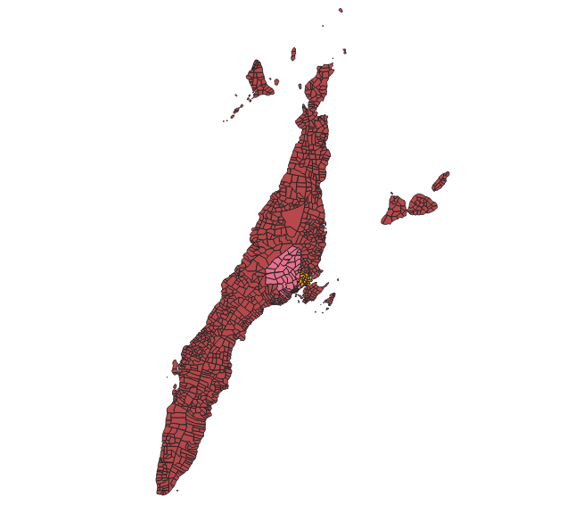
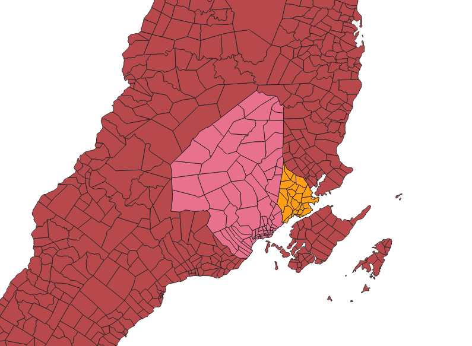
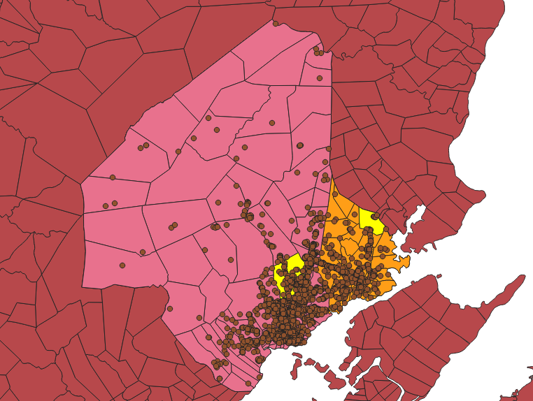
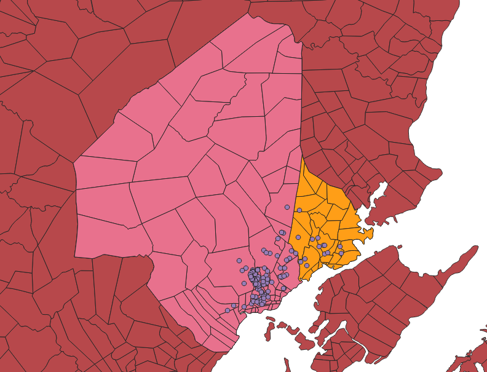
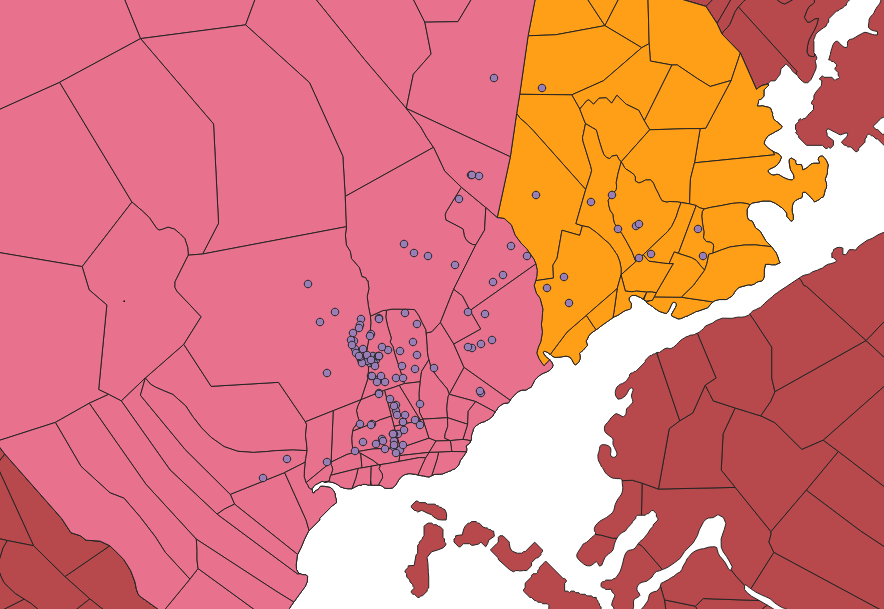

It's been a while since I've visited Cebu and it probably doesn't look the same 4 years ago. I decided to put myself to the test and see how well I know Cebu—or at least Cebu City and Mandaue City since I've spent more than 10 years of my life in those cities.

First, I downloaded the shape files for Cebu from [PhilGis](http://philgis.org/). Then, I used QGIS to map the shape files and visualize it.

Let's identify where Cebu City and Mandaue City are located.

The area in pink is Cebu City while the area highlighted in yellow is Mandaue City.

I've lived in Mandaue City for more than half of my life and I didn't expect it to be so much smaller than Cebu City! This goes to show how little I know of Cebu :sob:

I also tried plotting POIs (points of interest) on top of Cebu City and Mandaue City and highlighted in bright yellow the key barangays in each city where I usually was: Jagobiao for Mandaue City and Lahug for Cebu City.

From the image you can see that points of interest (hotels, supermarkets, hospitals, schools, restaurants, etc.) are all crowded to the lower right. This is probably because these are the areas that are most accessible when you're coming from the airport in Lapu-Lapu City (the island at the bottom of both cities).

To further support this hypothesis, I filtered the points of interest to only show hotels.

As we can see, they are all located at the bottom. This allows tourists to be near the airport while also being in the capital. I also noticed that there aren't a lot of hotels in Mandaue City. The hotels were clumped specifically in barangays Capitol Site, Camputhaw, Guadalupe, Santa Cruz, and Sambag II in Cebu City.

If you're planning to visit Cebu, I think these are the best places to find a hotel.

And that's it for my very basic analysis of Cebu! There's still a lot to learn and I think mapping is one of the best ways to understand it.

Special thanks to Ardie for the QGIS lessons!